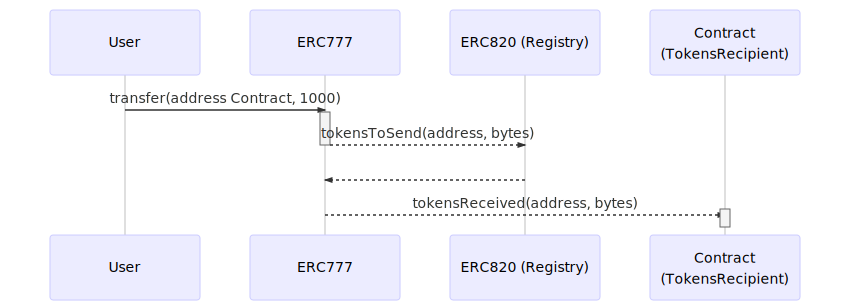

<!-- markdownlint-disable MD002 -->
<!-- markdownlint-disable MD012 -->
<!-- markdownlint-disable MD033 -->
<!-- markdownlint-disable MD041 -->
# What are ERC standards?

The ‘Ethereum Request for Comments’ (ERC) is a document that smart contract programmers using the Ethereum blockchain platform write. They describe rules in these documents that Ethereum-based tokens must comply with.

### The ERC-20 : Standard Fungible Token

This standard provides basic functionality to transfer tokens, as well as allow tokens to be approved so they can be spent by another on-chain third party.

### The ERC-223 : token standard
ERC223 is a modification of ERC20 token standard. It provides standard functions a token contract and contract working with specified token can implement to prevent accidentally sends of tokens to contracts and make token transactions behave like ether transactions.

### The ERC-667 : transferAndCall Token Standard

### The ERC-721 : Non-fungible Token Standard 
While fungible tokens can be divided, non-fungible tokens (NFTs) can not. NFTs can be owned and transacted by individuals as well as consigned to third party brokers/wallets/auctioneers ("operators"). NFTs can represent ownership over digital or physical assets.

### The ERC-777 token contract
This standard takes advantage of [EIP-820](https://github.com/ethereum/EIPs/issues/820) to notify contracts and regular addresses when they receive tokens as well as to be compatible with old contracts.

### The ERC-809 : Renting Standard for Rival, Non-Fungible Tokens
Rival good: a good is rival if its consumption by one individual prevents simultaneous consumption by other individuals. For example, driving a car is rival but watching the sunset is non-rival.

Non-Fungible good: a good is non-fungible if it is not interchangeable. For example, cars are non-fungible but Ether is fungible.

ERC-809 allows an owner to rent access to their rival NFTs using a standard set of commands, thus allowing users to view all past and current rental agreements from a single wallet interface.

### ERC-864 : NFTs Shared Ownership
This proposal aims to enable shared ownership of NFTs natively in the NFT contract.

### The ERC-865 : TransferPreSigned
This proposal describes one standard function a token contract can implement to allow a user to delegate transfer of tokens to a third party. The third party pays for the gas, and takes a fee in tokens. Ability for token holders to pay transfer transactions in tokens instead of gas, in one transaction.

### ERC-874 : Weighted Non Fungible Tokens
Not all NFTs are created equal. Nothing exists to distinguish one NFT from another. Weight allows a DAO or other external actors to recognize some value for unique asset holdings.

### ERC-888 : MultiDimensional Token Standard 
Proposing a model for multidimensional tokenization, which utilizes identifiers to refer to balances & data.